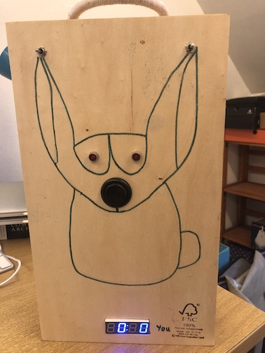
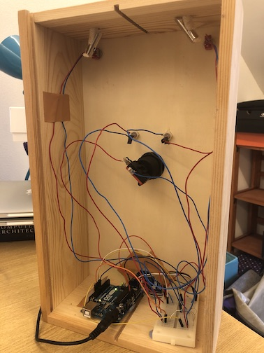
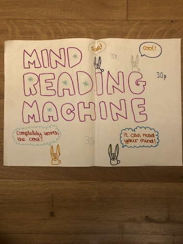
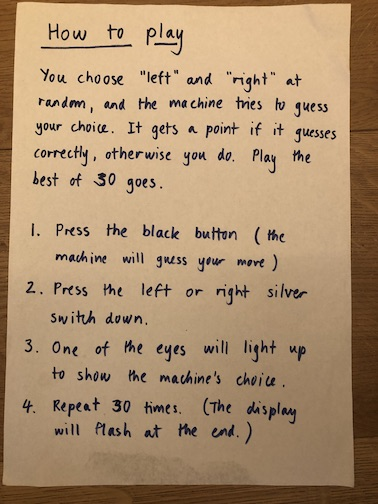

# The Outguessing Machine

In William Poundstone’s [“How to Predict the Unpredictable"](https://www.goodreads.com/en/book/show/21049067-how-to-predict-the-unpredictable) he introduces us to Dave Hagelberger's "outguessing machine", a machine that played a version of a penny guessing game against an opponent and tried to predict human choices.

Claude Shannon built his own version. And according to Poundstone:

> In long sequences of plays against the same person, Shannon's machine was correct about 65 percent of the time.

Poundstone has more on his [blog](http://william-poundstone.com/blog/2015/7/30/how-i-beat-the-mind-reading-machine), including a photo of the machine.

You can read a bit more about Shannon and his machine in ["Claude Shannon: Tinkerer, Prankster, and Father of Information Theory"](https://spectrum.ieee.org/claude-shannon-tinkerer-prankster-and-father-of-information-theory).

And if you want to read the original paper, it's called [A Mind-Reading (?) Machine](https://this1that1whatever.com/miscellany/mind-reader/Shannon-Mind-Reading.pdf).

## Arduino Recreation

I built a version of Shannon's machine in 2016 running on an Arduino. The drawing on the front was by Lottie, my daughter, who was 11 at the time.

We exhibited it at Lottie's summer school fair.

### Parts list

- 1x Arduino Uno and power supply
- 1x Mini breadboard
- 1x Button – Arcade Style, Concave, 35mm, Black (e.g. SparkFun COM-09339)
- 2x Toggle Switch – Single Pole – Mom-OFF-Mom (e.g. Proto-PIC 734-7148P)
- 2x Red LED - 5mm
- 2x LED Holder - 5mm
- 1x Adafruit 0.56" 4-Digit 7-Segment Display w/I2C Backpack - Blue
- Jumper wires
- Solid core wire
- Solder
- Enclosure (I used a wooden wine box)

### Program

[outguessing.ino](outguessing.ino)
